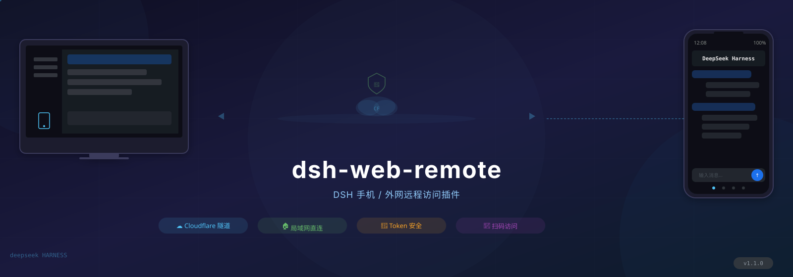
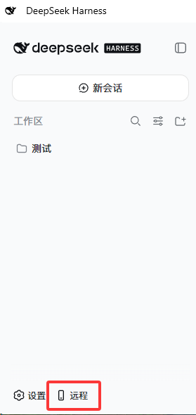
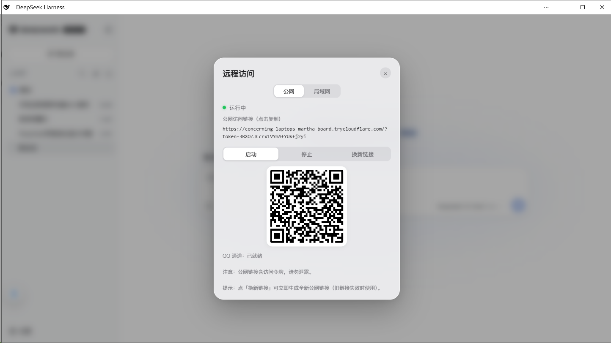

# dsh-web-remote

<p align="center">
  
</p>

[](https://github.com/godchen520/dsh-web-remote)
[](https://opensource.org/licenses/MIT)
[](https://github.com/deepseek-ai/deepseek-harness)
[](../../pulls)

<p align="right">
  <b>中文</b> | <a href="README_EN.md">English</a>
</p>

> 手机 / 外网远程访问 DeepSeek Harness（DSH）的插件。随时随地通过浏览器，或**微信 / 飞书 / Telegram / QQ官方** 机器人控制你的 DSH。

## ✨ 功能亮点

| 功能 | 说明 |
|------|------|
| 🌐 **公网访问** | Cloudflare Quick Tunnel，无需公网 IP、无需注册，`cloudflared` 缺失时自动下载 |
| 📡 **局域网直连** | HTTP + HTTPS 直连（HTTPS 自动生成自签名证书，零配置） |
| 🔒 **安全认证** | 每次启动生成随机令牌；HttpOnly Cookie；局域网可免 token |
| ⚡ **性能加速** | 反向代理自动 gzip 压缩，大历史会话加载更快 |
| 📱 **侧边栏图标** | 手机快捷按钮常驻左下角，刷新不消失 |
| 🔗 **自定义公网链接** | 支持填写自定义公网 URL（如 ngrok），面板编辑/清除，重启后生效 |
| 🔌 **自定义端口** | 局域网模式下可修改 HTTPS 端口号，带端口占用检测 |
| 🤖 **微信机器人** | iLink 协议直连微信，支持 AI 对话、会话控制、模型切换 |
| 💬 **飞书机器人** | WebSocket 长连接，支持命令控制、会话监听通知 |
| ✈️ **Telegram 机器人** | 长轮询收发消息，支持 HTTP 代理、命令控制、监听推送 |
| 🐧 **QQ 官方机器人** | QQ 开放平台官方接入，WebSocket 长连接，**无需额外 QQ 号 / 公网入口** |
| 👁️ **会话监听** | `/监听` 命令，Agent 思考完毕自动推送到已绑定通道 |
| 🩺 **通道健康监测** | 微信/飞书/Telegram/QQ官方 独立监测，连续 3 次失败自动告警并停止，红点直达 + 一键重连 |

## ⚡ 一句话安装

复制下面这句话给你的 DSH，它自己会装好一切：

> 请帮我安装 dsh-web-remote 远程访问插件（https://github.com/godchen520/dsh-web-remote），装完告诉我如何重启 DSH Web。

不想麻烦 Agent？命令行一条：

```bash
dsh plugin --profile web add github:godchen520/dsh-web-remote && dsh web
```

## 📸 截图

**快捷按钮**（页面左下角）：



**远程面板**（公网 / 局域网切换、一键复制链接、二维码、启动 / 停止）：



## 📋 安装方式

### 方式一：GitHub 直接安装（推荐）

```bash
cd $DSH_HOME/profiles/web
pnpm add github:godchen520/dsh-web-remote
```

在 `package.json` 的 `dsh.profile.bundles` 数组中添加 `"dsh-web-remote"`，重启 DSH。

> `--config.minimumReleaseAge=0` 可绕过 pnpm 11 新包发布年龄校验（如需要）。

### 方式二：手动 patch

把本包放入 profile 的 `node_modules`，然后在 `cordis.patch.yml` 追加：

```yaml
- insert:
    - id: web-remote
      name: 'dsh-web-remote'
```

> bundle 方式需重启；cordis.patch.yml 方式会被 HMR 热加载。

## ⚙️ 配置

全部可选，不配置即开箱即用。在 `cordis.patch.yml` 里覆盖：

| 参数 | 默认值 | 说明 |
|------|--------|------|
| `targetPort` | `3080` | DSH 自身端口 |
| `httpPortStart` | `3081` | 局域网 HTTP 起始端口（自动跳过占用） |
| `httpsPortStart` | `3082` | 局域网 HTTPS 起始端口 |
| `qqPortStart` | `3001` | QQ OneBot 桥起始端口 |
| `cloudflaredPath` | `''` | 指定 cloudflared 路径；留空自动探测 / 自动下载 |
| `pfxPath` | `''` | 指定 PFX 证书；留空自动生成自签名 |
| `pfxPass` | `''` | PFX 密码 |
| `toolsDir` | `''` | 工具与证书缓存目录；留空使用 `$DSH_HOME/tools` |
| `autoStart` | `true` | 插件加载即自动启动 |
| `lanOpen` | `true` | 局域网免 token（私网来源放行） |

## 📱 使用方法

1. 启动后页面左下角出现 📱 图标
2. 点击图标 → 面板显示运行状态和链接
3. 手机浏览器打开链接即可访问 DSH

**公网**：`https://xxx.trycloudflare.com/?token=...`
**局域网**：`https://192.168.x.x:3082`（同 Wi-Fi；默认免 token）

**面板新功能（v1.3.0）：**
- 公网标签页：可填写自定义公网 URL（如自己的 ngrok 地址）
- 局域网标签页：可点击端口号直接修改 HTTPS 端口

## 🤖 微信机器人

通过微信直接控制 DSH，支持：

**远程控制命令：**
- `/链接` — 获取公网链接（未启动自动开启）
- `/停止远程` — 关闭远程服务
- `/监听` — 开启/关闭会话监听模式（思考完毕自动通知）

**会话管理：**
- `/会话列表` — 列出所有会话
- `/选择 N` — 选中第 N 个会话
- `/当前会话` — 查看选中会话名称
- `/历史内容` — 查看会话最近输出

**模型切换：**
- `/当前模型` — 查看当前使用的模型
- `/切换模型` — 列出所有模型并切换
- `/选强度 N` — 设置思考强度

**对话：**
- 直接发送内容 → 自动发到选中的会话并回传结果
- 未选择会话时提示先选择

## 💬 飞书机器人

通过飞书直接控制 DSH，支持：

**远程控制命令：**
- `/链接` — 获取公网链接
- `/停止远程` — 关闭远程服务
- `/监听` — 开启/关闭会话监听模式
- `/帮助` — 显示命令列表

**绑定方式：**
在 DSH Web 面板 → 机器人标签页 → 飞书，填写 App ID 和 App Secret，点击绑定。

## ✈️ Telegram 机器人

通过 Telegram 直接控制 DSH，支持：

**远程控制命令：**
- `/链接` — 获取公网链接
- `/停止远程` — 关闭远程服务
- `/监听` — 开启/关闭会话监听模式
- `/帮助` — 显示命令列表

**绑定方式：**
在 DSH Web 面板 → 机器人标签页 → Telegram，填写 Bot Token，点击绑定。

**代理支持：** 国内网络无法直连 Telegram API 时，可在面板中配置 HTTP 代理地址。

## 🐧 QQ 官方机器人

通过 **QQ 开放平台**接入的官方机器人（非 NapCat 协议模拟），支持：

**远程控制命令：**
- `/链接` — 获取公网链接
- `/停止` — 关闭远程服务
- `/监听` — 开启/关闭会话监听模式
- `/模型` — 查看当前模型
- `/状态` — 查看通道状态
- `/帮助` — 显示命令列表

**场景支持：** QQ 群聊 + 消息列表单聊。

**接入方式：**

1. 打开 [QQ 开放平台快捷创建](https://q.qq.com/qqbot/openclaw/login.html)，用 QQ 登录后点「创建机器人」（个人主体可创建 5 个）
2. 在开放平台「开发设置」里复制 **AppID** 与 **AppSecret**
3. DSH Web 面板 → 机器人标签页 → **QQ官方**，填入后点「确认并连接」

**特点：**

| 项 | 说明 |
|---|---|
| 额外 QQ 号 | **不需要** —— 平台分配独立机器人身份，你的 QQ 只作为管理员 |
| 公网入口 | **不需要** —— 走 WebSocket 长连接，SDK 自带心跳与 RESUME 补发 |
| 备案 | **不需要** |
| 会话持久化 | 支持，进程重启后可 RESUME 补上断连期间的消息 |
| 主动推送 | 支持（需你曾给机器人发过消息；群聊需群主允许） |

**群聊启用：** 群主把机器人拉进群即可；若允许接收全量消息，需群主在机器人设置里开启。

**多通道关系：** 本通道与原有的 **QQ（NapCat）** 通道互相独立，可同时存在。NapCat 功能更全但有封号风险；官方机器人合规稳定，推荐长期使用。

## 🩺 通道健康监测

微信 / 飞书 / Telegram / QQ官方 各通道独立监测：

- 连续 **3 次**失败 → 自动停止该通道并告警
- 远程图标显示**红点**提示（任一通道断开即亮）
- **点击红点直达**出问题的通道页，提供**一键重连**按钮

## 🔧 兼容性

| DSH 版本 | 状态 |
|---|---|
| **0.2.x（0.2.0-rc.2 实测）** | ✅ 支持 |
| 0.1.2-rc.1 ~ 0.1.x | ✅ 支持 |
| < 0.1.2-rc.1 | ❌ 不支持（那之前 `session.events` 还是属性，没有 `snapshotEvents()`） |

本插件**不 import 任何 `@deepseek-ai/*` 官方包** —— 宿主能力（`webServer`、`subprocess`、`agents`、`sessions`、`sessionQuery` 等）全部通过 cordis 服务注入获取。因此 DSH 改动**包级导出**（例如 0.2.x 移除 `dsh-settings` 的 `settingsNamespace` / `installSettingsSection`）不会影响它。

需要跟着 DSH 适配的只有**服务接口本身**：目前用到 `session.snapshotEvents()`（0.1.2+ 的新形式）。

## ❓ 常见问题

**Q: 公网链接打开提示"不安全"？**
A: 这是 HTTPS 自签名证书的预期行为。手机浏览器选择「继续访问」即可。Edge 需关闭"增强安全性"。

**Q: 重启 DSH 后链接变了？**
A: 公网隧道每次重启会生成新地址，这是正常行为。微信绑定的 token 会自动持久化恢复。

**Q: cloudflared 下载失败？**
A: 首次启动需要联网下载 cloudflared（约 10MB），之后复用缓存。可手动下载放到 `toolsDir` 目录。

**Q: 微信扫码后断开？**
A: 重启 DSH 后微信会自动重连（token 已持久化）。如仍断开，重新发送 `/链接` 扫码绑定。

## 📝 更新日志

查看 [CHANGELOG.md](CHANGELOG.md) 了解版本更新历史。

## 🤝 贡献

欢迎贡献！请查看 [CONTRIBUTING.md](.github/CONTRIBUTING.md) 了解开发和提交流程。

## 📄 License

[MIT](LICENSE)
