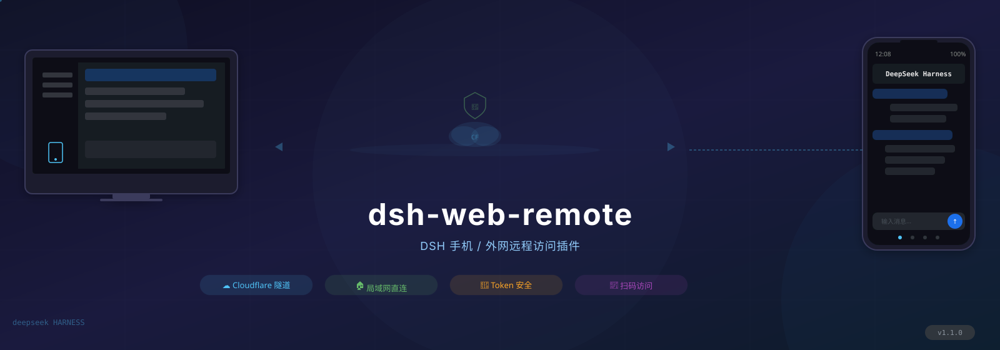
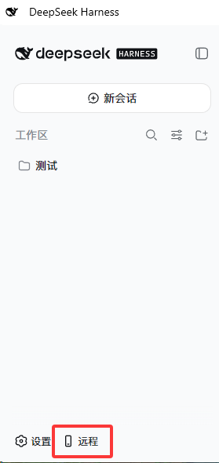
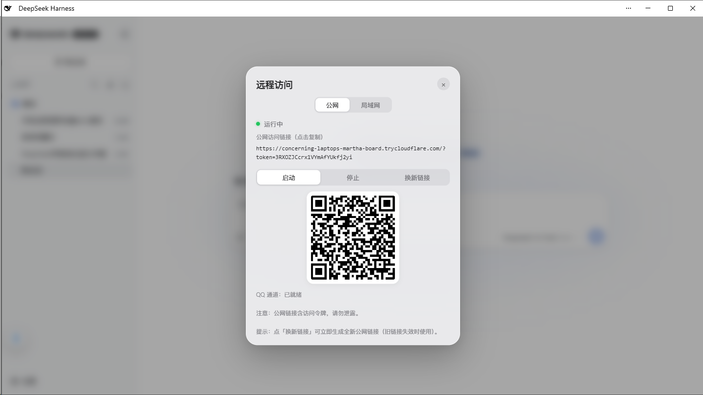

# dsh-web-remote

<p align="center">
  
</p>

[](https://github.com/godchen520/dsh-web-remote)
[](https://opensource.org/licenses/MIT)
[](https://github.com/deepseek-ai/deepseek-harness)
[](../../pulls)

<p align="right">
  <a href="README.md">中文</a> | <b>English</b>
</p>

> A plugin for DeepSeek Harness (DSH) that enables mobile and remote access via phone browser or WeChat.

## ✨ Features

| Feature | Description |
|---------|-------------|
| 🌐 **Public Access** | Cloudflare Quick Tunnel — no public IP or registration needed; auto-downloads `cloudflared` |
| 📡 **LAN Direct** | HTTP + HTTPS direct connection (HTTPS with auto-generated self-signed cert, zero config) |
| 🔒 **Secure Auth** | Random token per start; HttpOnly Cookie; LAN can be token-free |
| ⚡ **Performance** | Reverse proxy with automatic gzip compression for faster large session loads |
| 📱 **Sidebar Icon** | Phone shortcut button persists in the bottom-left corner |
| 🤖 **WeChat Bot** | iLink protocol direct connection to WeChat; AI chat, session control, model switching |
| 💬 **QQ Bot** | NapCat OneBot 11 reverse WebSocket (work in progress) |

## 🚀 Quick Start

**3 steps:**

```bash
# 1. Install plugin (run in DSH profile directory)
cd $DSH_HOME/profiles/web
pnpm add github:godchen520/dsh-web-remote

# 2. Register bundle (edit package.json)
# Add "dsh-web-remote" to the "dsh.profile.bundles" array

# 3. Restart DSH
dsh web
```

A 📱 icon appears in the bottom-left corner → click to open the remote panel.

## 📸 Screenshots

**Sidebar button** (bottom-left corner):



**Remote Panel** (Public / LAN switch, copy link, QR code, start/stop):



## 📋 Installation

### Option 1: GitHub Install (Recommended)

```bash
cd $DSH_HOME/profiles/web
pnpm add github:godchen520/dsh-web-remote
```

Add `"dsh-web-remote"` to `dsh.profile.bundles` in `package.json`, then restart DSH.

> Use `--config.minimumReleaseAge=0` if pnpm 11 blocks new packages.

### Option 2: Manual Patch

Place the package in profile's `node_modules`, then add to `cordis.patch.yml`:

```yaml
- insert:
    - id: web-remote
      name: 'dsh-web-remote'
```

> Bundle install requires restart; cordis.patch.yml supports HMR hot-reload.

## ⚙️ Configuration

All optional. Override in `cordis.patch.yml`:

| Option | Default | Description |
|--------|---------|-------------|
| `targetPort` | `3080` | DSH's own port |
| `httpPortStart` | `3081` | LAN HTTP start port (auto-skips occupied) |
| `httpsPortStart` | `3082` | LAN HTTPS start port |
| `qqPortStart` | `3001` | QQ OneBot bridge start port |
| `cloudflaredPath` | `''` | Specify cloudflared path; empty = auto-detect / auto-download |
| `pfxPath` | `''` | PFX certificate; empty = auto-generate self-signed |
| `pfxPass` | `''` | PFX password |
| `toolsDir` | `''` | Tool & cert cache directory; empty = `$DSH_HOME/tools` |
| `autoStart` | `true` | Auto-start on plugin load |
| `lanOpen` | `true` | LAN token-free mode (private network bypass) |

## 📱 Usage

1. After start, a 📱 icon appears in the bottom-left corner
2. Click the icon → panel shows status and links
3. Open the link in your phone browser

**Public:** `https://xxx.trycloudflare.com/?token=...`
**LAN:** `https://192.168.x.x:3082` (same Wi-Fi; token-free by default)

## 🤖 WeChat Bot

Control DSH directly from WeChat:

**Remote Control Commands:**
- `/link` — Get public link (auto-starts if stopped)
- `/stop` — Stop remote service

**Session Management:**
- `/sessions` — List all sessions
- `/select N` — Select session N
- `/session` — Show selected session name
- `/history` — Show session's recent output

**Model Switching:**
- `/model` — Show current model
- `/switch-model` — List and switch models
- `/effort N` — Set reasoning effort

**Chat:**
- Send content directly → auto-sends to selected session with result
- Shows prompt to select a session when none is selected

## ❓ FAQ

**Q: Public link shows "not secure"?**
A: Expected for self-signed HTTPS certs. Choose "Continue anyway" in your phone browser. Edge may need "Enhanced Security" turned off.

**Q: Link changes after DSH restart?**
A: Public tunnel generates a new address each restart — this is normal. WeChat-bound tokens auto-restore.

**Q: cloudflared download fails?**
A: First start needs internet to download cloudflared (~10MB). Afterwards it's cached. You can also manually place it in `toolsDir`.

**Q: WeChat disconnects after scanning?**
A: After DSH restart, WeChat auto-reconnects (token is persisted). If still disconnected, re-send `/link` to rebind.

## 📝 Changelog

See [CHANGELOG.md](CHANGELOG.md) for version history.

## 🤝 Contributing

See [CONTRIBUTING.md](.github/CONTRIBUTING.md) for development and submission guidelines.

## 📄 License

[MIT](LICENSE)
